# RemoteApp, RD Web Client y Autenticación RADIUS en Windows Server

**Estudiante:** Edwin De Paula  
**Matrícula:** 2024-2415  
**Institución:** Instituto Tecnológico de las Américas (ITLA)  
**Asignatura:** Seguridad de Redes

---

## Video

| Recurso | URL |
|---|---|
| Video YouTube | https://youtu.be/wwFUXqiGML8 |

---

## Objetivo

Configurar en un Windows Server 2019 los servicios de RDP RemoteApp y RD Web Client para publicar una página personalizada de IIS, junto con un servidor NPS (RADIUS) que asigna dos niveles de acceso distintos. Del lado de red, un router Cisco autentica sus sesiones administrativas (SSH) contra ese mismo servidor RADIUS, con registro completo de logs de autenticación, autorización y RADIUS. El cliente consulta la página publicada a través de ambos servicios de RemoteApp y valida el acceso SSH al router vía RADIUS.

Esta topología reutiliza la infraestructura de red (routers, DMVPN, direccionamiento) construida previamente, cuyo esquema de IPs se deriva igualmente de la matrícula del estudiante (2024-2415), red base `10.24.15.0/24`.

---

## Topología

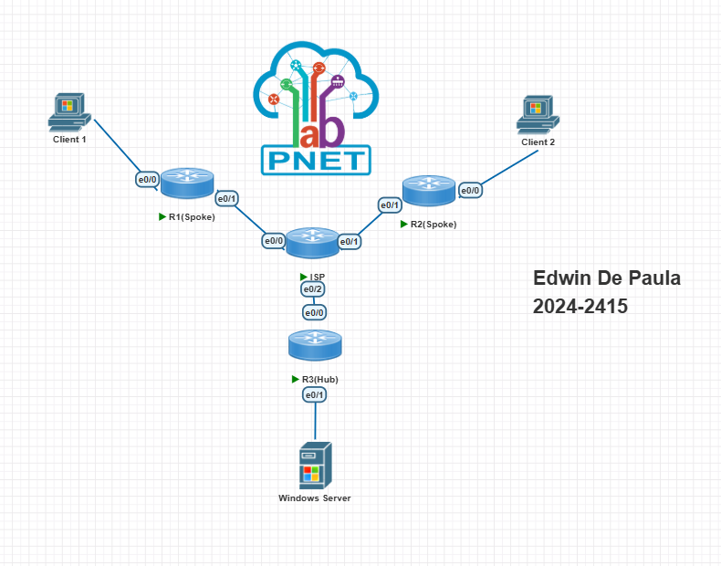

| Dispositivo | Rol | Dirección IP |
|---|---|---|
| Cliente | Consulta RemoteApp / SSH al router | 10.24.15.0/25 (vía túnel DMVPN) |
| Router | AAA / cliente RADIUS | 10.24.15.33/28 |
| Windows Server (ADDC01.dwn.lab) | AD DS, IIS, RDS (RemoteApp + RD Web Client), NPS | 10.24.15.34/28 |

La comunicación entre el Cliente y el segmento del Windows Server atraviesa el túnel DMVPN ya establecido en la infraestructura reutilizada.

---

## Parámetros de Configuración

### IIS — Página personalizada

| Parámetro | Valor |
|---|---|
| Ruta | `C:\inetpub\wwwroot\index.html` |
| Default Document | `index.html` |
| URL de acceso | `http://10.24.15.34` |

### RDS — RemoteApp

| Parámetro | Valor |
|---|---|
| Tipo de despliegue | Session-based desktop deployment (Quick Start) |
| Roles instalados | RD Connection Broker, RD Web Access, RD Session Host |
| Programa publicado | Firefox |
| Argumento de línea de comandos | `http://10.24.15.34` |
| Modo de acceso | Always use the following command-line parameters |

### RDS — RD Web Client

| Parámetro | Valor |
|---|---|
| Módulo | RDWebClientManagement |
| Rol adicional | RD Gateway |
| Certificado | Certificado propio, aplicado a Gateway, Web Access, Connection Broker (SSO y Publishing) |
| URL de acceso | `https://ADDC01.dwn.lab/RDWeb/webclient/` |

### NPS — Grupos y usuarios por nivel de acceso

| Política | Grupo AD | Usuario | Cisco-AVPair |
|---|---|---|---|
| Acceso-Priv15 | RADIUS-Priv15 | admin2415 | `shell:priv-lvl=15` |
| Acceso-Priv1 | RADIUS-Priv1 | invitado2415 | `shell:priv-lvl=1` |

### Router — AAA / RADIUS

| Parámetro | Valor |
|---|---|
| Usuario local | `admin-local`, privilege 15 |
| Enable secret | Configurado |
| RADIUS server | 10.24.15.34, puertos 1812/1813 |
| Método de autenticación | `aaa authentication login default group RADIUS-GROUP local` |
| Método de autorización | `aaa authorization exec default group RADIUS-GROUP local` |
| Accounting | `aaa accounting exec/network default start-stop group RADIUS-GROUP` |
| Acceso administrativo | SSH (VTY 0 4) |

---

## Explicación de la Configuración

### RemoteApp y RD Web Client

Se instaló el rol de Remote Desktop Services en modalidad Session-based, lo que despliega automáticamente RD Connection Broker, RD Web Access y RD Session Host sobre el mismo servidor. Firefox se publicó como programa RemoteApp con un argumento de línea de comandos fijo apuntando a la página de IIS, de modo que al ejecutarlo el usuario ve únicamente el contenido de la página, sin el resto de la interfaz del navegador.

El RD Web Client añade una capa adicional: el rol de RD Gateway y el paquete HTML5 (`RDWebClientManagement`), que permiten consultar el mismo RemoteApp directamente desde el navegador, sin depender del cliente RDP nativo de Windows. Ambos servicios publican el mismo recurso (Firefox → página de IIS), cumpliendo el requisito de acceder a la página por los dos métodos.

### NPS y niveles de acceso

Se crearon dos grupos de seguridad en Active Directory, cada uno vinculado a una Network Policy en NPS. Cada política agrega el atributo Vendor-Specific `Cisco-AV-Pair` con el valor `shell:priv-lvl=X`, que el router interpreta al autenticar por RADIUS para determinar automáticamente el nivel de privilegio de la sesión, sin necesidad de pedir la contraseña de `enable` por separado.

### AAA en el router

El router usa `aaa new-model` con un grupo de servidores RADIUS apuntando al NPS. El orden de autenticación intenta primero RADIUS y cae a la base de usuarios local (`admin-local`) si el servidor no responde, evitando quedar sin acceso administrativo ante una falla del RADIUS. La autorización de exec (`aaa authorization exec`) es la que aplica el nivel de privilegio recibido del NPS a la sesión SSH.

---

## Verificación

### Página personalizada de IIS

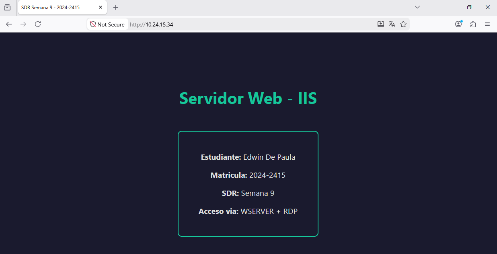

### Acceso a la página vía RemoteApp clásico (RD Web Access)

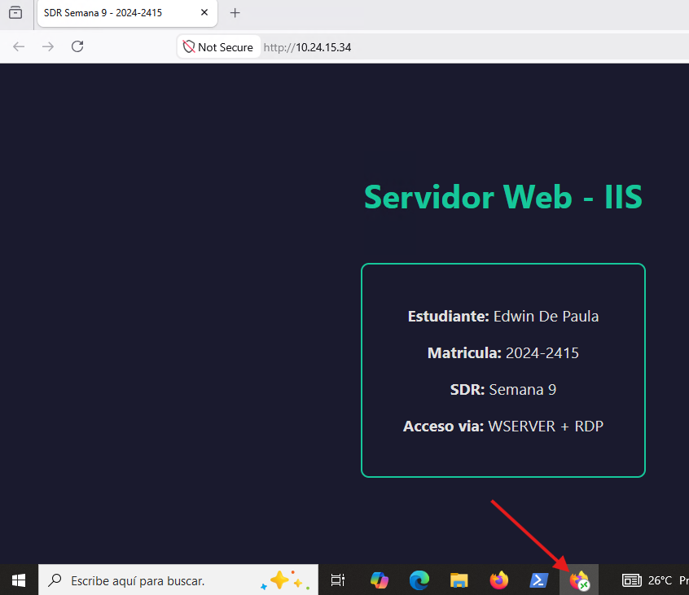

Inicio de sesión en RD Web Access, ejecución de Firefox publicado y carga de la página de IIS dentro de la sesión remota.

### Acceso a la página vía RD Web Client (HTML5)

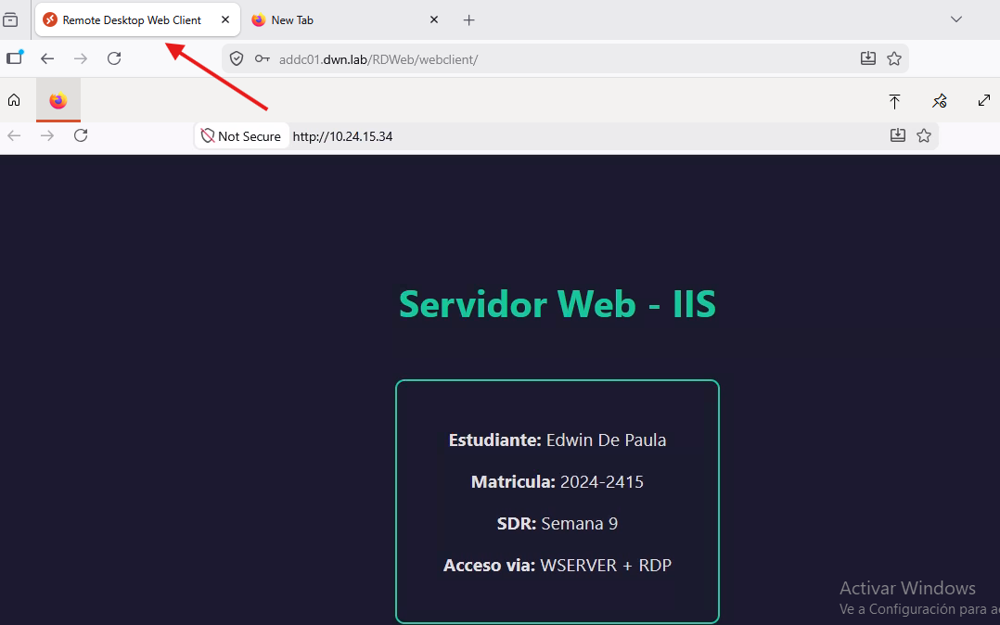

Mismo recurso, consultado esta vez desde el cliente HTML5 sin cliente RDP nativo.

### NPS — Políticas de red por nivel de acceso

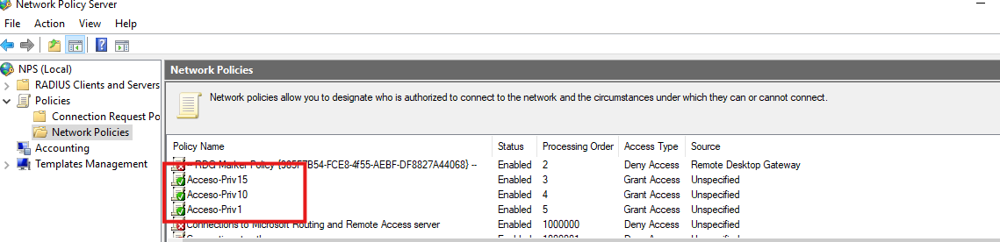

### NPS — Grupos y usuarios en Active Directory

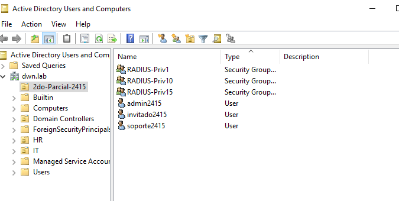

### Router — Usuario local y configuración AAA

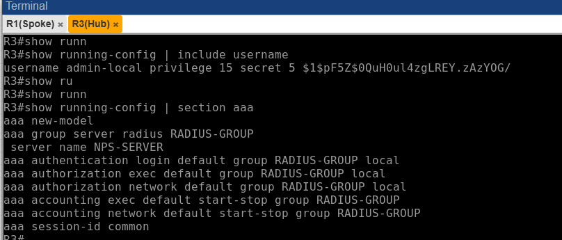

### Router — Password del modo de configuración

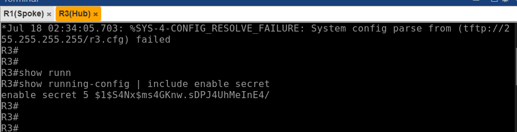

### SSH al router vía RADIUS, con logs de auditoría en vivo

```
debug aaa authentication
debug aaa authorization
debug radius
```

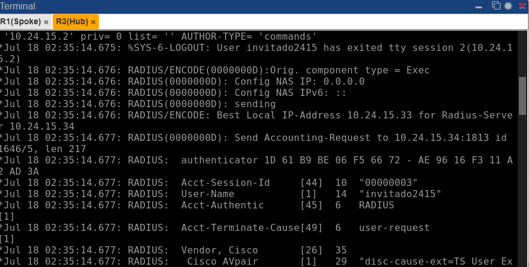

Intercambio Access-Request / Access-Accept visible en la consola del router durante el login SSH del usuario `admin2415`.

### Confirmación del nivel de privilegio asignado

```
show privilege
```

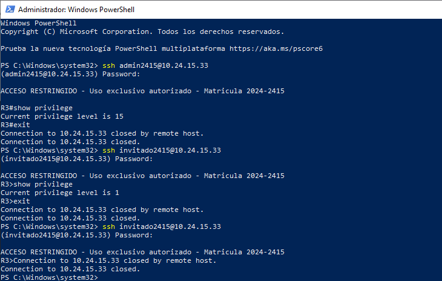

### Estado del servidor RADIUS y sesiones activas

```
show aaa servers
show aaa sessions
```

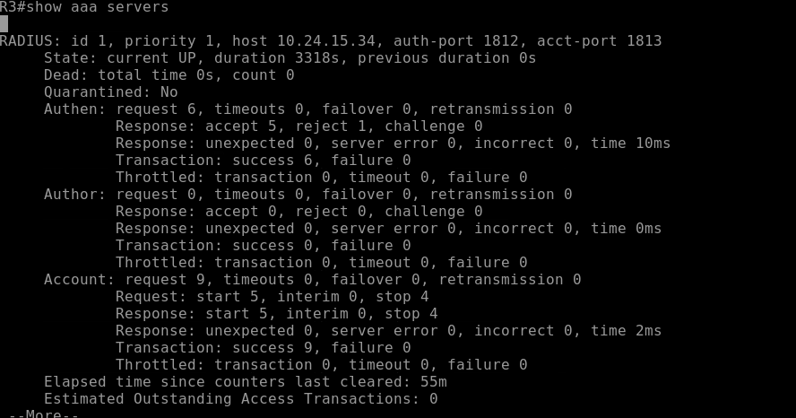

---

## Archivos del Repositorio

```
Windows-Server-RemoteApp-NPS-2024-2415/
├── docs/
│   ├── documentacion-tecnica.pdf
│   └── screenshots/
│       ├── topology.png
│       ├── iis-custom-page.png
│       ├── remoteapp-classic-access.png
│       ├── remoteapp-webclient-access.png
│       ├── nps-policies.png
│       ├── nps-groups-users.png
│       ├── router-local-user-aaa.png
│       ├── router-enable-secret.png
│       ├── ssh-radius-debug.png
│       ├── show-privilege.png
│       └── show-aaa-servers-sessions.png
└── README.md
```

---

## Herramientas Utilizadas

- PNetLab — Plataforma de emulación de red
- Cisco IOSv 15.4(2)T4 — Router con soporte AAA/RADIUS
- Windows Server 2019 — AD DS, IIS, Remote Desktop Services, NPS
- VMware Workstation — Virtualización del servidor PNetLab y del Windows Server
